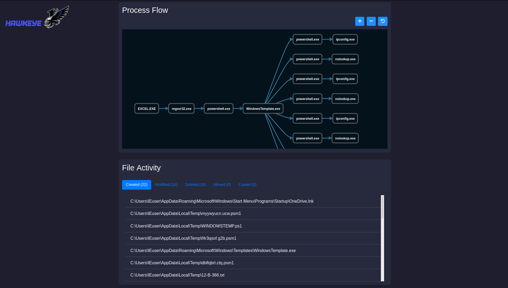
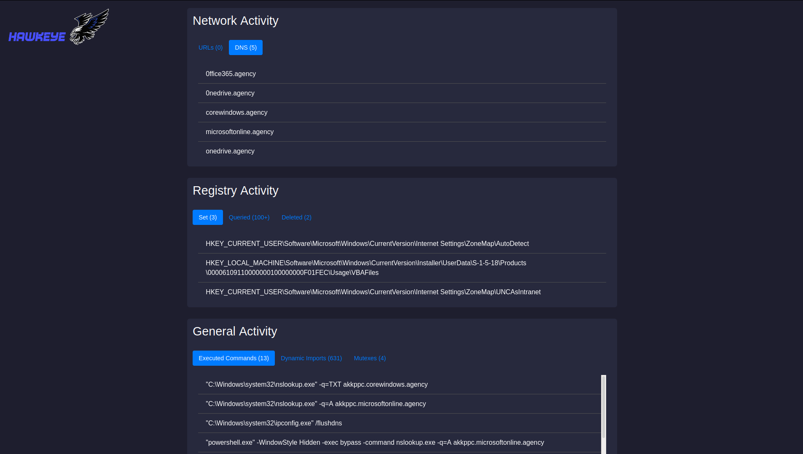

# HawkEye

HawkEye is a malware dynamic instrumentation tool based on [frida.re](https://www.frida.re/) framework. It will hook common functions to log malware activities and output the results in a nice web page report.

This is not a sandbox so please use it in a safe sandboxed environment.

# Installation

- Install the prerequisites 

```
pip install frida
pip install psutil
```

- Clone this repository

```
git clone https://github.com/N1ght-W0lf/HawkEye.git
```

# Usage

```
usage: HawkEye.py [-h] [--path PATH] [--pid PID]

optional arguments:
  -h, --help   show this help message and exit
  --path PATH  File path
  --pid PID    Process PID
```

HawkEye runs in 2 modes:

- spawn a malware sample in a new process given its path.
- hook a running process given its PID.

# Hooked Functions

#### Processes:

- <a href="#">CreateProcessInternalW</a>
- <a href="#">OpenProcess</a>
- <a href="#">VirtualAllocEx</a>

#### Files:

- <a href="#">CreateFile</a>
- <a href="#">WriteFile</a>
- <a href="#">MoveFile</a>
- <a href="#">CopyFile</a>
- <a href="#">DeleteFile</a>

#### Registry:

- <a href="#">RegCreateKey</a>
- <a href="#">RegOpenKey</a>
- <a href="#">RegQueryValueEx</a>
- <a href="#">RegSetValueEx</a>
- <a href="#">RegDeleteValue</a>

#### Network:

- <a href="#">InternetOpenUrl</a>
- <a href="#">GetAddrInfo</a>

#### General:

- <a href="#">LoadLibrary</a>
- <a href="#">GetProcAddress</a>
- <a href="#">CreateMutex</a>

# Example Report

 

I've also uploaded a video for a full report from analysis to final results.

 [https://www.youtube.com/watch?v=DnCj2Dt6OcE]( https://www.youtube.com/watch?v=DnCj2Dt6OcE)
